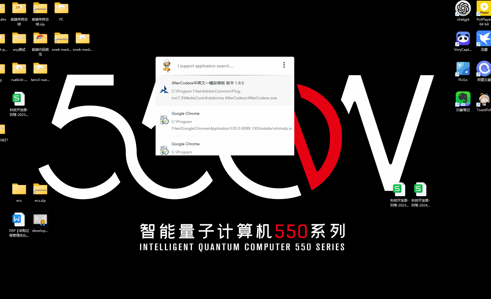
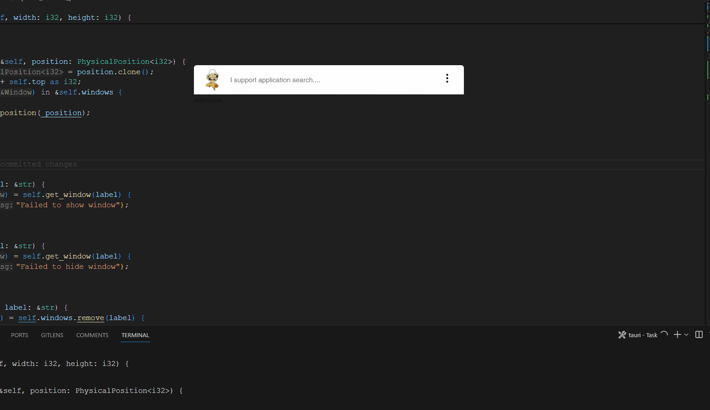

# usopp

基于[Tauri](https://tauri.app/) 复刻 [rubick](https://github.com/rubickCenter/rubick) 项目。
项目初衷用于学习Rust, 代码现阶段凌乱, 后期会进行重构、优化。

### 演示

#### 程序、文件夹搜索


#### 自定义指令开启


#### Webview into Windwo效果


### 开发
需要安装rust.
```
pnpm i 

pnpm run tauri 
```

### 开发中
- [x] 应用程序列表
- [x] 支持拼音搜索
- [x] 系统最小托盘
- [x] 支持文件夹
- [x] 自定义指令打开 idea/vscode 方案探索阶段, 未来灵活可配 
- [ ] 窗口内嵌实现
- [ ] 插件支持
- [ ] 系统设置


### 指令
目前探索阶段

vscode:
idea: 
