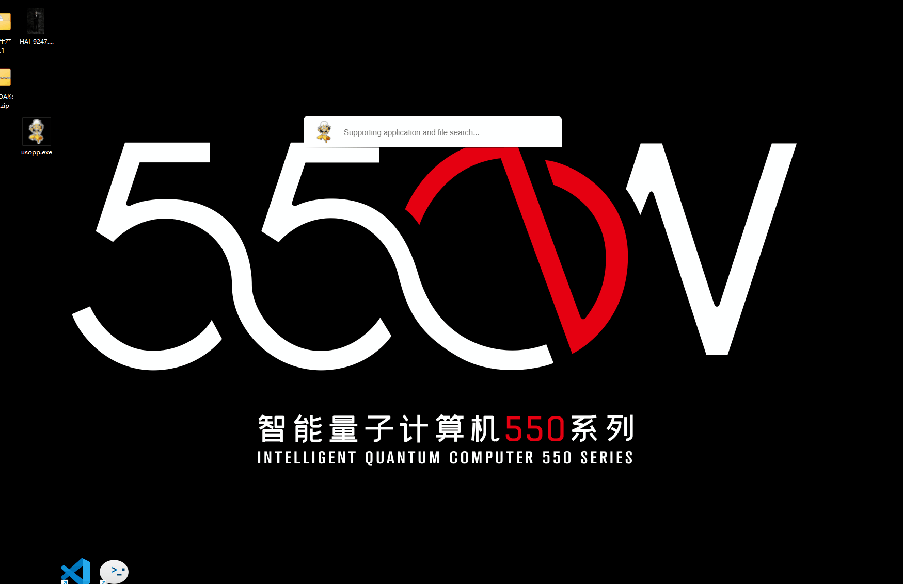

<div align= "center">
  
   <h1>usopp</h1>
</div>

基于[Tauri](https://tauri.app/) 复刻 [rubick](https://github.com/rubickCenter/rubick) 项目。

项目初衷用于学习Rust, 代码现阶段凌乱, 后期会进行重构、优化。

如果你有更好的实现, 欢迎提交pr.


### 支持
- 📋 应用程序列表
- 🔎 支持拼音搜索
- 📌 系统最小托盘
- 📁 支持文件夹、文件搜索


### 待办
- [ ] 插件支持
- [ ] 系统设置
- [ ] Mac适配

### 演示

#### 程序、文件夹搜索


### 开发
需要安装rust.
```
pnpm i 

pnpm run tauri 
```


## 开源协议

[MIT](https://zh.wikipedia.org/wiki/MIT%E8%A8%B1%E5%8F%AF%E8%AD%89)
